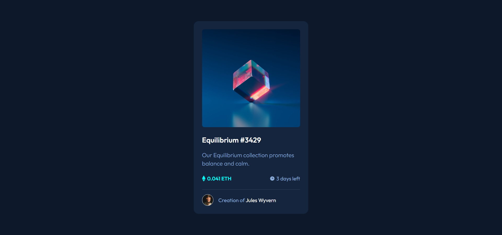
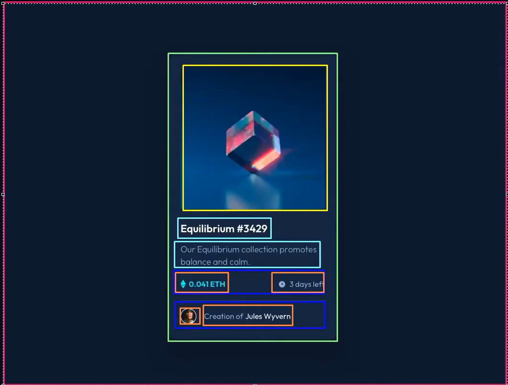

# Frontend Mentor - NFT preview card component

Esse projeto é uma solução para o desafio [NFT preview card component challenge on Frontend Mentor](https://www.frontendmentor.io/challenges/nft-preview-card-component-SbdUL_w0U).

## Table of contents

- [Meu processo](#meu-processo)
  - [O desafio](#o-desafio)
  - [Screenshot](#screenshot)
  - [Foi utilizado](#foi-utilizado)
  - [O que aprendi](#o-que-aprendi)

- [Autoria](#autoria)

## Meu Processo

### O desafio

O desafio exige que usuários sejam capazes de:

- Ver o layout otimizado, independente do tamanho de tela do dispositivo em que for acessado.

- Ver mudanças de estilo quando houver interação com os links com Hover.

### Screenshot

### Foi utilizado

- HTML5
- CSS
- Flexbox

### O que aprendi

Foi de grande ajuda analizar a estrutura da imagem base antes de começar o código em si. Me poupou tempo durante a escrita e ajudou a perceber melhor como se dá a construção deestruturas básicas.

## Autoria

- LinkedIn - [Samuel Matheus Brito](www.linkedin.com/in/samuel-matheus-brito-a88493282)
- Frontend Mentor - [@j0rmungardm](https://www.frontendmentor.io/profile/j0rmungardm)
